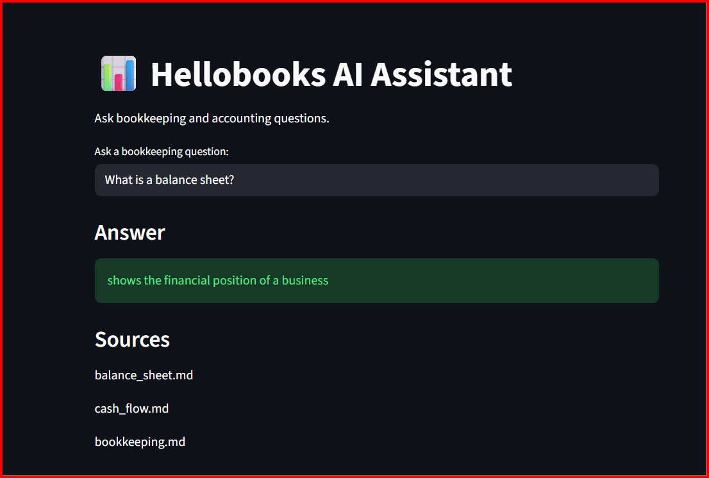

# 📊 Hellobooks AI Assistant (RAG)

An AI-powered bookkeeping assistant built using **Retrieval-Augmented Generation (RAG)**.

This project answers basic accounting and bookkeeping questions using a local knowledge base, semantic search, and a lightweight language model.

---

# 🚀 Live Demo

Try the deployed application here:

🔗 **Hellobooks AI Assistant**
https://hellobooks-rag-assistant-aktqrvlbj8gxjqkf2hk8jt.streamlit.app/

---

# 🚀 Features

* Retrieval-Augmented Generation (RAG)
* Local knowledge base (markdown documents)
* Semantic search using embeddings
* Vector search using **FAISS**
* Local LLM (**FLAN-T5**)
* Source citations for answers
* Streamlit web interface
* Live deployed AI assistant

---

# 🧠 Architecture

```
User Question
      ↓
Sentence Transformer Embedding
      ↓
FAISS Vector Search
      ↓
Retrieve Relevant Documents
      ↓
FLAN-T5 Language Model
      ↓
Answer Generation + Sources
```

---

# 📁 Project Structure

```
hellobooks-rag-assistant
│
├── app
│   ├── config.py
│   ├── prompts.py
│   └── vectorstore.py
│
├── knowledge_base
│   ├── bookkeeping.md
│   ├── invoices.md
│   ├── balance_sheet.md
│   ├── profit_and_loss.md
│   └── cash_flow.md
│
├── scripts
│   ├── ingest.py
│   └── query.py
│
├── app_ui.py
├── requirements.txt
└── README.md
```

---

# ⚙️ Installation

Clone the repository

```
git clone https://github.com/YOUR_USERNAME/hellobooks-rag-assistant.git
cd hellobooks-rag-assistant
```

Create virtual environment

```
python -m venv venv
```

Activate environment

Windows

```
venv\Scripts\activate
```

Mac/Linux

```
source venv/bin/activate
```

Install dependencies

```
pip install -r requirements.txt
```

---

# 📚 Prepare Knowledge Base

Place your accounting documents in:

```
knowledge_base/
```

Example topics:

* Bookkeeping
* Invoices
* Profit and Loss
* Balance Sheet
* Cash Flow

---

# 🔄 Ingest Documents

Generate embeddings and store them in the vector database.

```
python scripts/ingest.py
```

---

# 💬 Run CLI Assistant

Ask bookkeeping questions from terminal.

```
python scripts/query.py
```

Example:

```
What is a balance sheet?
```

---

# 🌐 Run Web Interface

Launch the Streamlit UI.

```
streamlit run app_ui.py
```

Open in browser:

```
http://localhost:8501
```

---

# 📸 Application Preview

### Streamlit Web Interface



---

# 🧪 Example Questions

* What is bookkeeping?
* What is a balance sheet?
* What is an invoice?
* What is the difference between profit and cash flow?
* What does a profit and loss statement show?

---

# 🛠 Tech Stack

* Python
* Sentence Transformers
* FAISS Vector Search
* HuggingFace Transformers
* FLAN-T5
* Streamlit

---

# 📈 Future Improvements

* Document chunking for better retrieval
* Hybrid search (BM25 + vector search)
* Conversation memory
* FastAPI backend
* Docker deployment

---

# 📄 License

MIT License

---

# 👨‍💻 Author

**Harsh Kumar**
B.Tech Computer Science (Data Science)
ABES Engineering College
